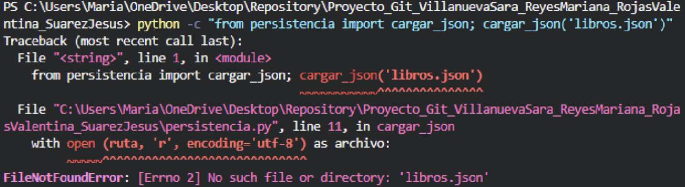
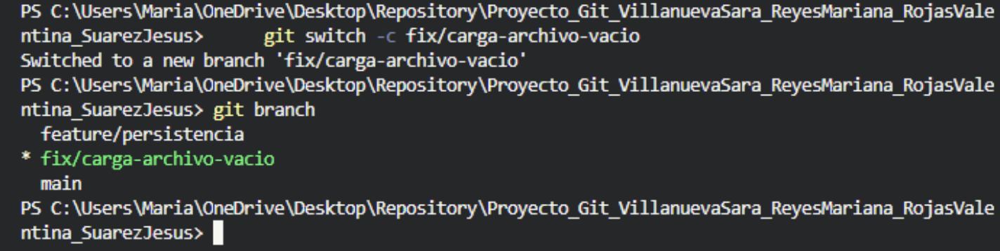
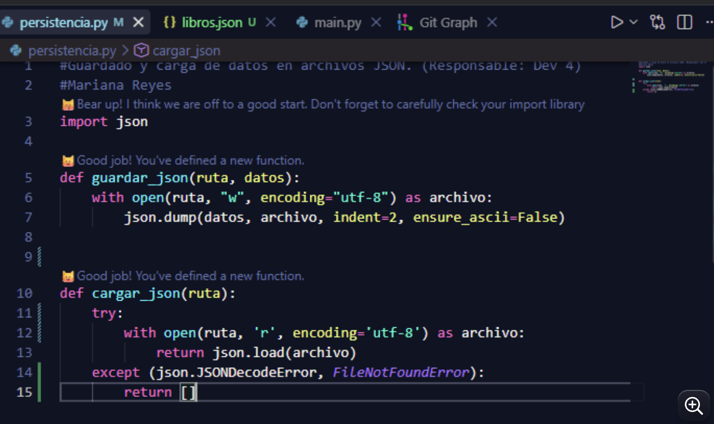
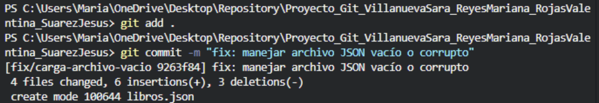
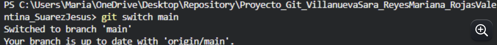

# BiblioStock CLI - Biblioteca Horizonte

Sistema de inventario y préstamos por terminal en Python.

## Integrantes
- Dev 1: Sara Villanueva 
- Dev 2: Mariana Reyes
- Dev 3: Valentina Rojas
- Dev 4: Jesus Suarez

Estado del proyecto: en desarrollo

## Resolución del conflicto de fusión

Pendiente: Describir en qué archivo y línea apareció el conflicto, cómo se identificó (git status), cómo se resolvió y adjuntar las capturas.

## Evidencia de Corrección de Error y Flujo de Trabajo en Git

## 1. Flujo Inicial y Comandos Básicos de Git

### Clonación del Repositorio (git clone)
Para obtener una copia local del proyecto en el entorno de desarrollo:

git clone https://github.com/sarettavkro-debug/Proyecto_Git_VillanuevaSara_ReyesMariana_RojasValentina_SuarezJesus
#### Sincronización de Cambios (git pull)
Para mantener la rama local actualizada con los últimos cambios en la nube:

git pull origin main
### Explicación del comando git switch -c
El comando git switch -c <nombre-rama> realiza dos acciones simultáneas:
1. -c (create): Crea una nueva rama local.
2. switch: Cambia el entorno de trabajo directamente a esa rama.

Se utiliza para aislar el desarrollo de una nueva funcionalidad o corrección (fix/*) sin afectar la rama estable main.

## 2. Reproducción del Error en Terminal

Al intentar cargar un archivo JSON inexistente, vacío o corrupto mediante la función cargar_json(), Python lanza una excepción:
python -c "from persistencia import cargar_json; cargar_json('libros.json')"

Resultado en consola:

Traceback (most recent call last):

FileNotFoundError: 
[Errno 2] No such file or directory: 'libros.json'
 
Ver captura: 

## 3. Creación de la Rama de Corrección (fix/*)

Se creó la rama aislada fix/carga-archivo-vacio para implementar la solución:
git switch -c fix/carga-archivo-vacio
git branch
Salida de confirmación: feature/persistencia
* fix/carga-archivo-vacio
main
Ver captura:

## 4. Implementación del Manejo de Excepciones (try/except)

En el archivo persistencia.py, se estructuró la función con un bloque try/except para capturar json.JSONDecodeError y FileNotFoundError, devolviendo una lista vacía [] si ocurre un fallo:

## 5. Guardado, Commit y Push a GitHub

Se registraron los cambios en Git y se publicaron en el repositorio remoto:
git add .
git commit -m "fix: manejar archivo JSON vacío o corrupto"
git push origin fix/carga-archivo-vacio
Confirmación en terminal:
[fix/carga-archivo-vacio 9263f84] fix: manejar archivo JSON vacío o corrupto
4 files changed, 6 insertions(+), 3 deletions(-)
create mode 100644 libros.json
Ver captura:

## 6. Sincronización Final con la Rama main
Posterior a la integración del Pull Request en GitHub por parte de Dev 1, se cambió a la rama main y se descargaron las actualizaciones:
git switch main
git pull origin main
Confirmación de actualización:
Switched to branch 'main'
Your branch is up to date with 'origin/main'.
Ver captura:

## Repositorio
https://github.com/sarettavkro-debug/Proyecto_Git_VillanuevaSara_ReyesMariana_RojasValentina_SuarezJesus

git config --global user.name "sarettavkro-debug"
git config --global user.mail "saretta.vkro@gmail.com"
mkdir Proyecto_Git_VillanuevaSara_ReyesMariana_RojasValentina_SuarezJesus
cd Proyecto_Git_VillanuevaSara_ReyesMariana_RojasValentina_SuarezJesus
git init

## Comandos de Git utilizados

### 1. Los comandos usados en este proyecto se determianan según la etapa en la que estuvimos trabajando. Para empezar el proyecto requeria inicializar un repositorio, por eso era necesario empezar con estos comandos:

git config --global user.name "sarettavkro-debug"
git config --global user.mail "saretta.vkro@gmail.com"
mkdir Proyecto_Git_VillanuevaSara_ReyesMariana_RojasValentina_SuarezJesus
cd Proyecto_Git_VillanuevaSara_ReyesMariana_RojasValentina_SuarezJesus
git init

### 2. Creamos nuestro primer commits y damos nombre a la rama principal del proyecto con estos comandos:

git add .
git commit -m "feat: crear estructura inicial del proyecto"
git branch -M main
git remote add origin https://github.com/sarettavkro-debug/Proyecto_Git_VillanuevaSara_ReyesMariana_RojasValentina_SuarezJesus
git push -u origin main

### 3. Aquí inicia en trabajo independiente de cada desarrollador, para que pudieran participar en el código del repositorio correctamente fue necesari que escribieran estos comandos:

git config --global user.name "sarettavkro-debug"
git config --global user.mail "saretta.vkro@gmail.com"
git clone https://github.com/sarettavkro-debug/Proyecto_Git_VillanuevaSara_ReyesMariana_RojasValentina_SuarezJesus
cd Proyecto_Git_VillanuevaSara_ReyesMariana_RojasValentina_SuarezJesus
git switch -c feature/su-funcionalidad 

### En el ultimo comando el desarrollador debía reemplazar "su-funcionalidad" según el rol asignado, en el caso del desarrollador 1 que fue asignado a fearure/menu-principal debia poner:
git switch -c feature/menu-principal

### 4. A lo largo del proyecto los colaboladores reportaron haber usado comandos como estos cuando trabajaban dentro de su rama. 
git branch
git status
git add inventario.py
git commit -m "feat: agregar función registrar_item con validaciones"
git push -u origin feature/registro-inventario
git push
git pull

### Para unir ramas estos fueron los comandos más usados:
git switch main
git pull origin main
git merge feature/prestamos

Para traer informacion actualizada los comandos usados fueron:
git pull origin main
git pull 

jesus y Valentina
link: https://drive.google.com/drive/folders/11oC8UiiHweiGcsoUbwqi3s50hQPPHHTJ?usp=sharing

